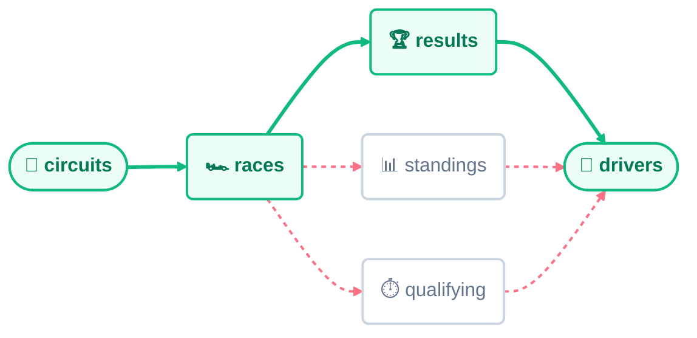

# Common Path Expressions (CPEs)

A **CPE (Common Path Expression)** names an explicit multi-hop join path and lets you use it afterwards like an ordinary table.
It is the tool you reach for whenever **RTGL**'s automatic path resolution cannot - or should not - pick the path for you.

This guide covers the syntax, how an alias resolves, the extra rule temporal queries impose.
It pairs with [`experiments/02-common-path-expressions.ipynb`](../experiments/02-common-path-expressions.ipynb), where every query is executed against a real dataset and checked, label for label, against its **RelBench** reference task.

See [RTGL Fundamentals](./01-rtgl-fundamentals.md) for the base query grammar.

## Table of Contents

- [What a CPE Is](#what-a-cpe-is)
- [A Real Ambiguity](#a-real-ambiguity)
- [Syntax](#syntax)
- [Usage](#usage)
- [Temporal CPEs](#temporal-cpes)
- [When a CPE Is Not Enough](#when-a-cpe-is-not-enough)

## What a CPE Is

By default, **RTGL** automatically finds the shortest path of foreign keys between two tables, so a standard query never has to state *how* they connect - see [Automatic Multi-Hop](./01-rtgl-fundamentals.md#automatic-multi-hop).
That default holds most of the time, and while it holds, a CPE would add nothing.

It stops holding as soon as the schema offers more than one equally good paths.
When several paths of the same length connect the same two tables, RTGL has nothing left - so rather than guess, it rejects the query.
A **CPE** supplies the missing answer: you name the path, and RTGL joins through it instead of searching for one.

The table below summarises every outcome automatic resolution can produce, and whether a CPE is the needed:

| Situation | What happens without a CPE | Is a CPE needed? |
| :--- | :--- | :--- |
| **One** shortest path exists | RTGL resolves it. | No. |
| Several paths, of **different** lengths | **Warning**: the shortest is used, and RTGL reports which path it picked. | Only if you want one of the longer paths. |
| Several paths, of the **same** length | **Error**: RTGL refuses to guess and rejects the query as ambiguous. | Yes - this is the case CPEs exist for. |
| **No** path exists at all | **Error**: the two tables are not connected. | No - see the limitation below. |

Every hop you declare must correspond to a foreign key the schema already knows about.
RTGL checks each one during validation.

When the relationship you need genuinely does not exist as a declared foreign key, the tool you want is an [SQL injection](./03-sql-injections.md) instead.

Aside from the path, a CPE changes nothing: aggregations, conditions, windows, and temporal masking all behave exactly as they do in a standard query.

## A Real Ambiguity

The clearest way to see why CPEs exist is to watch automatic resolution fail on a real schema.

Take `rel-f1` dataset from **RelBench** and its [`driver-circuit-compete`](../experiments/02-common-path-expressions.ipynb#driver-circuit-compete) task, which asks which circuits a driver will compete on in the coming year.
Answering it means connecting `circuits` to `drivers` - and the schema offers three ways to do that, all exactly the same length:



*Solid green marks the path the task actually needs; the dashed paths are equally short, and equally usable to a shortest-path search.*

Every path leaves `circuits` through `races` and arrives at `drivers`; they differ only in the bridge table in between.
For this task just one of them is correct, because `results` is the table that records a driver having taken part in a race.
A `standings` row or a `qualifying` entry answers a subtly different question.

RTGL cannot know which meaning you had in mind - all three paths are equal by length - so it reports the ambiguity and stops.

## Syntax

CPEs are declared in the optional `WITH` clause, which precedes every other clause in the query:

```sql
WITH <path_name_1> AS (
    <src_table>.<src_key> -> <table_1>.<left_key_1>[:<right_key_1>] -> ... -> <dst_table>.<dst_key>
), <path_name_2> AS (...), ...
```

Six pieces of notation carry the whole construct:

| Element | Name | Meaning |
| :--- | :--- | :--- |
| *\<path_name>* | **path alias** | The name the path is declared under, and the name used to reference it later. |
| *\<src_table>.\<src_key>* | **source node** | Where the path begins, and the table an alias reference resolves to - see [Usage](#usage). |
| *->* | **hop** | A single foreign-key step between two nodes. |
| *\<table>.\<left_key>* | **node** | One table on the path, together with the key it is *entered* on. |
| *:\<right_key>* | **right key** | The key used to leave a node, when it differs from the one it was entered on. |
| *\<dst_table>.\<dst_key>* | **destination node** | Where the path ends - the table being joined toward. |

A CPE therefore needs at least two nodes - a **source** and a **destination** - and may declare as many intermediate nodes in between as the path requires.

### The Right Key

The optional *:\<right_key>* suffix exists because a bridge table is sometimes entered on one column and left on another.
In `races.circuitId:raceId`, for instance, the `races` row is matched on `circuitId` and then left through `raceId`.
Where a node is entered and left on the same key, the suffix is simply omitted - which is why the destination node never carries one: the path ends there, so there is nothing to leave through.

### Referencing an Alias

Once declared, *\<path_name>.\<column>* can be used anywhere *\<table>.\<column>* would be - in an aggregation, in a condition, or in either `WHERE` and `ASSUMING` - and RTGL joins through the named path to reach it.
The one place an alias cannot appear is `FOR EACH`, which requires a direct table reference and rejects an alias during validation.

## Usage

One rule governs everything a CPE alias does:
*\<path_name>.\<column>* resolves against the CPE's **source** table - the first one listed - never the destination.

The **destination** is where the path *leads*: it is the table being joined toward, and in practice it is often the `FOR EACH` entity table.
The **source** is what the alias *stands for*: the table whose rows are aggregated, and whose columns the alias exposes.

```sql
WITH circuits_drivers AS (
    circuits.circuitId->races.circuitId:raceId->results.raceId:driverId->drivers.driverId
)
PREDICT LIST_DISTINCT(circuits_drivers.*, 0, 365, DAYS)
FOR EACH drivers.*;
```

Here the source is `circuits` and the destination is `drivers`, which matches `FOR EACH`.
So `circuits_drivers.*` resolves to `circuits` own primary key, and the query reads as *"the list of circuit ids this driver competed at"*.

## Temporal CPEs

A temporal aggregation needs a time column for its window to apply to, and that requirement extends to CPEs unchanged.
Along a declared path, the **source table or one of the intermediate tables** must have a time column.

The destination node is deliberately excluded from this check.
Its time column has a different job: as the `FOR EACH` entity table, it acts as the **temporal masking** filter described in [RTGL Fundamentals](./01-rtgl-fundamentals.md#for-each).

If no table on the path is time-aware, RTGL rejects the query.

## When a CPE Is Not Enough

A CPE only follows foreign keys the schema already declares, and only in the `table.key -> table.key` shape the grammar defines.
Two situations fall outside that:

- **The relationship is not a declared foreign key.** No sequence of hops can express a join RTGL does not know exists.
- **The join needs logic the grammar cannot carry** - e.g., a filter applied mid-path.

Both are the territory of **[SQL injections](./03-sql-injections.md)**, which let you supply raw SQL as a **virtual table** and declare its keys by hand.
